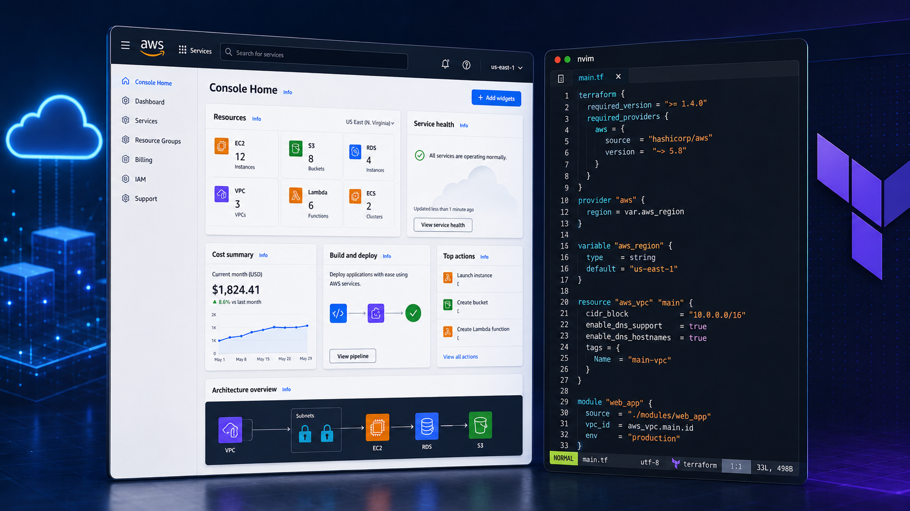
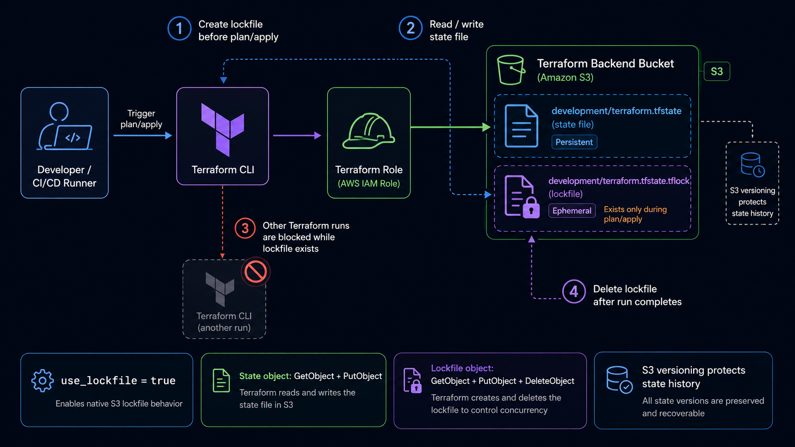
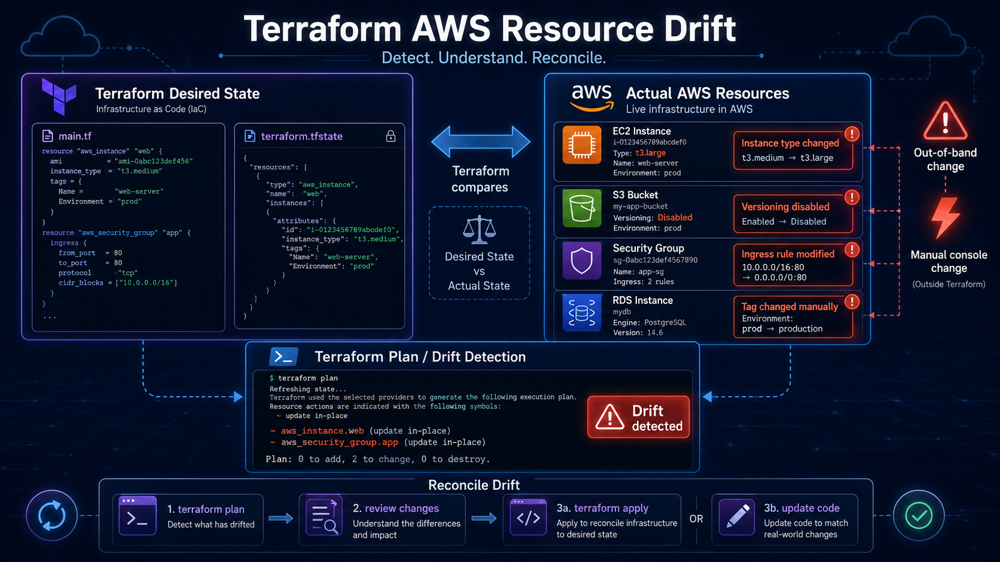

For a while, AWS made sense to me one service at a time.

Storage, compute, databases, networking, and IAM all have their own jobs.

I understood the basic job of each service.

But this project taught me that knowing the services is only part of it. The bigger challenge is getting them to work together in a real setup.

That is where things started to click.

Before this project, I was already comfortable working in the AWS console. The console is useful. You can explore services, test settings, and see how AWS organizes things.

But for a real project, clicking around is not enough.

You need infrastructure that can be repeated. You need changes that can be reviewed. You need a setup that someone else can understand without asking, "What did you click?"

That is where Terraform changed the game for me.

This project helped me see AWS, Terraform, and CI/CD as one connected workflow instead of separate tools.



## Moving From Manual Setup to Infrastructure as Code

The goal was to build a development environment for a real-world project and set it up in a way that could grow over time.

The first big step was setting up Terraform with remote state in S3.

That might sound like a boring backend detail, but it matters a lot.

Terraform state is how Terraform keeps track of what it created. It knows what exists in AWS, what settings were used, and what needs to change next.

Local state is fine when you are testing something alone. But for a real project, the state file should not just live on one laptop.

So I moved the state into an S3 backend and started treating it like an important part of the infrastructure.

## Remote State, Versioning, and Locking

Remote state taught me that Terraform best practices are not just about writing good code. They are also about keeping the process safe.

The state file needs to be shared, protected, and recoverable.

That is why S3 versioning is important.

With versioning turned on, the state file has history. If something gets overwritten or a bad apply causes an issue, there is a way to recover instead of panicking.

Locking is important too.

Without locking, two people, or two automation jobs, could run Terraform at the same time against the same environment. That can cause conflicts or mess up the state file.

Terraform's S3 backend now supports native state locking with an S3 lockfile by setting `use_lockfile = true`. Older setups often used DynamoDB for locking, but DynamoDB-based locking is deprecated in the S3 backend.

A safer Terraform backend setup includes:

- Remote state in S3
- Versioning enabled on the state bucket
- Native S3 lockfiles to prevent two runs at the same time
- Limited access to the backend
- Separate state for each environment
- `terraform plan` before applying changes
- Manual approval before risky changes

This was when Terraform started to feel less like a tool that just creates resources and more like a safer way to manage infrastructure changes.



## A Few Terraform Practices That Stuck With Me

As the project grew, I started caring more about the Terraform workflow itself.

At first, it is easy to focus only on whether the resources get created. But the process around Terraform matters just as much.

A basic safe workflow started to look like this:

```bash
terraform fmt -recursive
terraform validate
terraform plan -out=development.tfplan
terraform apply development.tfplan
```

`terraform fmt -recursive` keeps the Terraform code formatted across modules and environments.

`terraform validate` catches configuration issues before planning.

`terraform plan -out=development.tfplan` saves the exact plan so it can be reviewed before applying.

`terraform apply development.tfplan` applies the reviewed plan instead of creating a new one at apply time.

For drift, I also started using:

```bash
terraform plan -refresh-only
```

That helped me compare Terraform state with the real AWS environment before making changes.

## Remote State Example

A simplified S3 backend looks like this:

```hcl
terraform {
  backend "s3" {
    bucket       = "example-terraform-state-bucket"
    key          = "development/terraform.tfstate"
    region       = "us-east-1"
    encrypt      = true
    use_lockfile = true
  }
}
```

The important parts are not the exact names. The important parts are the practices:

- Store state remotely
- Separate state by environment
- Encrypt the state file
- Enable versioning on the S3 bucket
- Use S3 lockfiles to prevent two Terraform runs at the same time
- Restrict access to the backend

One small permission detail matters here: the Terraform role needs access to the state object and to the lockfile object. When `use_lockfile` is enabled, Terraform creates a `.tflock` object next to the state file, so the role needs permission to read, write, and delete that lockfile while keeping the actual state file protected.

This is the kind of setup that makes Terraform safer once the infrastructure is part of a real project.

## Dealing With Drift

Another big lesson was Terraform drift.

Drift happens when what is actually in AWS does not match what Terraform thinks is there.

Sometimes that happens because someone changed a resource manually. Sometimes AWS updates something behind the scenes. Sometimes a provider update makes Terraform read a resource a little differently.

At first, drift can be annoying because Terraform shows changes you did not expect.

That is where `terraform plan -refresh-only` helped.

A refresh-only plan lets Terraform check the real AWS environment and compare it with the state file without trying to change anything right away.

That gave me a safer way to understand what was going on.

Instead of jumping straight to apply, I could stop and ask:

Is this a real change?  
Is this just AWS-managed info?  
Did the provider change how it reads this resource?  
Should I update the state, or should I update the Terraform code?

That made me more careful.

Terraform is powerful, but it is not something you should rush. Sometimes the best move is to slow down, check the drift, refresh the state on purpose, and understand what changed first.



## Building the Foundation

Once the backend was ready, I started building the core infrastructure.

The foundation covered the main pieces you would expect in a cloud environment: networking, access control, application runtime, storage, logging, and deployment support.

At first, I thought the hard part would be writing Terraform.

It was not.

The harder part was figuring out how the AWS resources should connect and how to keep that setup clean in code.

## Learning How AWS Resources Connect

One of the biggest things I learned was what belongs inside a VPC and what does not.

When you work in the AWS console, it is easy to think about each service by itself. Terraform made me think more about the full path: networking, permissions, dependencies, and traffic flow.

The VPC is where the network-scoped pieces live: private networking, routing, security boundaries, databases, and application networking.

Other AWS-managed services sit outside that VPC boundary, but they still connect to the app through permissions, endpoints, service integrations, or deployment pipelines.

That made the architecture much easier to understand.

Instead of just asking, "Which AWS service do I need?" I started asking better questions:

Where does the request start?  
What needs to be public?  
What should stay private?  
Which service needs permission to talk to another service?  
What path does the traffic take?  
What should Terraform manage?  
What should CI/CD handle?

That was a big shift for me.

## Building the Application Stack

The application stack included a containerized backend and a registry for storing application images.

That setup taught me a lot about the line between infrastructure and deployment.

This is where I hit one of those simple problems that teaches a bigger lesson.

The runtime was trying to deploy an image tag that had not been pushed to the registry yet. Terraform had created the infrastructure correctly, but the service could not run an image that was not there.

The infrastructure was fine. The app artifact was missing.

That made the connection between Terraform and CI/CD much clearer.

Terraform can build the environment, but the pipeline still has to build and ship the app into that environment.

I also ran into state and provider issues where AWS-managed fields changed behind the scenes. Terraform saw differences between state and the real infrastructure, and I had to figure out if it was a real change, provider behavior, or harmless drift.

That was when Terraform state really started to make sense.

Terraform is not just creating stuff. It is tracking what it owns, what the setup should look like, and what changed.

## Moving From App Runner to ECS Express Mode

A big part of the project was deciding how the backend should run.

App Runner is a good way to get a containerized service online quickly. It hides a lot of the operational details, which is useful when the goal is to prove that the app works.

But as the infrastructure became more complete, App Runner started to feel like the wrong long-term direction for this project.

For this project, App Runner no longer felt like the strongest long-term AWS path compared with ECS, especially around networking, IAM, deployment control, and ecosystem fit.

That made ECS Express Mode a better direction for this project.

The migration was not only about changing compute services. It was about moving away from a simple managed runtime and toward a runtime that matched where the rest of the AWS infrastructure was going.

With ECS Express Mode, the app stack became easier to reason about as part of the larger system:

```text
Container image is built in CI/CD
Image is pushed to the registry
ECS service runs the selected image tag
Networking and permissions are managed through Terraform
Deployments update the running service
```

That flow made the infrastructure and deployment responsibilities clearer.

Terraform owns the runtime resources. CI/CD owns the app artifact and release process.

## Why the Runtime Change Mattered

The App Runner setup helped me move fast at the beginning, but ECS Express Mode felt like a better fit for production-style infrastructure.

Instead of only asking, "Can this container run?" I had to think through questions like:

Where should the service live in the network?  
Which IAM role does the runtime need?  
Which permissions belong to deployment instead of runtime?  
How should logs be collected?  
What should trigger a new deployment?  
How does the service connect to private resources?

Those questions made the backend feel less isolated.

It was no longer just a container running somewhere. It was part of the same system as the VPC, registry, IAM roles, database, logs, and CI/CD pipeline.

That is the kind of setup Terraform is good at describing, because the relationships between resources are just as important as the resources themselves.

## Running Into Terraform Dependency Boundaries

One of the most useful lessons came from Terraform dependency boundaries.

At one point, I had modules passing too many values between each other. The more connected the runtime, networking, identity, storage, and deployment pieces became, the easier it was to create messy dependencies.

A simple version looked like this:

```text
The runtime needed configuration from another module
Another module needed runtime outputs
Deployment settings depended on both
Terraform could not build the graph cleanly
```

The fix was not just changing a line of Terraform. The fix was changing the design.

I had to stop passing outputs everywhere and make cleaner boundaries between modules. Some values needed to become stable inputs instead of hard dependencies. Some modules needed to know less about the whole system.

That was a useful lesson.

Sometimes the answer is not more Terraform code. Sometimes the answer is making the design simpler.

## Keeping Modules Focused

The infrastructure became easier to manage once I split responsibilities better.

The runtime module should own the application service. The networking module should own network shape and traffic boundaries. The registry module should own image storage. The deployment workflow should build and publish app artifacts.

Each module can still expose outputs, but those outputs should be intentional.

That made the setup easier to understand and reinforced a Terraform lesson I keep coming back to: modules should have clear jobs. A module should not need to understand the whole system to do its part.

## Thinking Through CI/CD

Once the infrastructure foundation was in place, I started planning the CI/CD workflow.

This was another step away from manual cloud setup and toward real cloud engineering.

The AWS console is useful for testing ideas. But for a real project, infrastructure changes need to be reviewed. Builds need to be repeatable. Deployments need guardrails.

For this project, GitHub Actions made the most sense.

The plan is to use GitHub Actions with AWS OIDC instead of long-lived AWS access keys. That lets the workflow assume an IAM role without storing permanent AWS credentials in the repo.

The workflow can handle:

- `terraform fmt -recursive -check`
- `terraform validate`
- `terraform plan -out=development.tfplan`
- Manual `terraform apply`
- Docker image builds
- Container registry pushes

For CI/CD, the main idea was to separate planning from applying.

A pull request workflow should be able to run:

```bash
terraform fmt -recursive -check
terraform validate
terraform plan -out=development.tfplan
```

But `terraform apply` should be more protected.

For example:

```text
Pull request:
Run fmt, validate, and plan

Manual workflow:
Apply the reviewed plan after approval
```

That separation matters because infrastructure changes can affect networking, databases, permissions, and live services.

Plan should be easy to run.

Apply should be intentional.

One design decision I cared about was not giving automatic workflows too much power.

A safer setup is to split responsibilities:

```text
Plan role:
Used automatically
Lower permissions
Runs formatting, validation, and plans

Apply role:
Used manually
Protected by environment approvals
Has stronger permissions
```

That is the kind of detail that matters in cloud work.

It is not just about whether the pipeline works. It is about whether the pipeline is safe, reviewable, and scoped the right way.

## What I Understand Better Now

This project taught me a lot more than how to write Terraform files.

I have a better understanding of:

- Remote Terraform state
- S3 backend versioning
- S3-native Terraform state locking
- Terraform drift
- Infrastructure as Code
- AWS provider behavior
- IAM roles and trust policies
- Runtime roles vs. deployment roles
- VPC routing
- Public and private subnets
- Security groups
- Private database networking
- Containerized application runtimes
- App Runner to ECS Express Mode migration
- Terraform dependency graphs
- GitHub Actions OIDC
- CI/CD permission boundaries

The biggest change was not one specific AWS service.

It was learning to think in systems.

AWS is not just a bunch of services. Terraform is not just resource blocks. CI/CD is not just automation for convenience.

The real work is understanding how traffic, permissions, state, app builds, and dependencies move through the system.

## Final Thoughts

This project started as a way to go deeper with AWS and Terraform.

It became more than that.

I went from understanding AWS services one by one to building a real development environment with networking, containers, ECS runtime design, storage, database infrastructure, and CI/CD planning.

It was not perfectly smooth. I ran into Terraform state issues, provider behavior, drift, dependency cycles, IAM confusion, missing image tags, networking decisions, and deployment questions.

That is what made it valuable.

Reading docs teaches the concepts. Working through the AWS console helps you understand how services behave. Building infrastructure with Terraform and connecting it to CI/CD teaches the real stuff.

The real learning happened in the messy parts: when Terraform could not build the graph, when the runtime could not find an image, when the state did not match AWS, when permissions were almost right but not quite, when the runtime design needed more control, and when the design needed to be simplified instead of patched again.

That is the part of cloud engineering I enjoy most: connecting the pieces, understanding the system, and making it more stable, secure, and repeatable.
