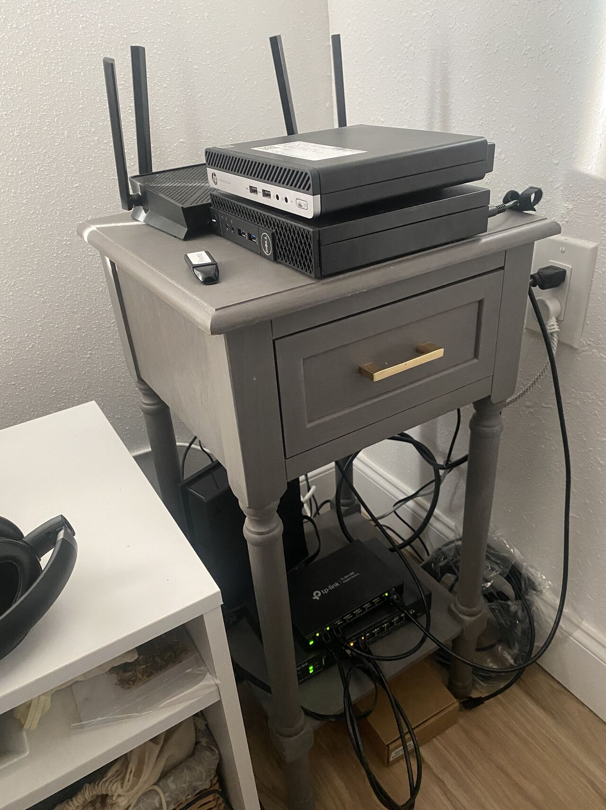
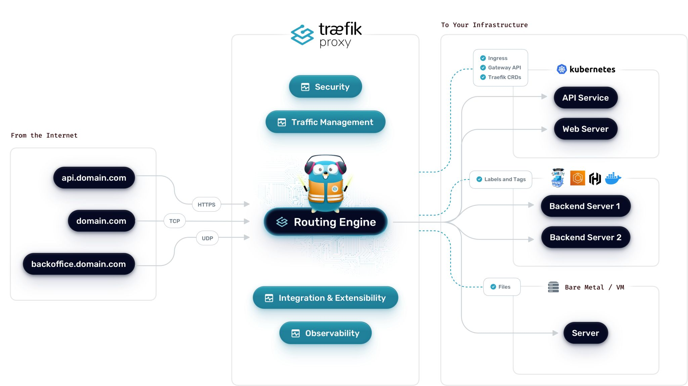
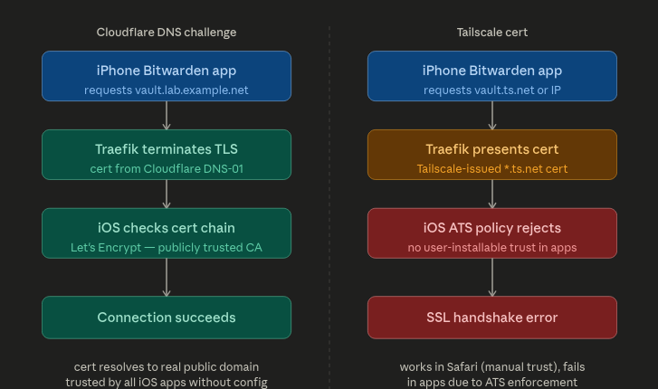

My homelab started as a few services thrown onto whatever hardware I had. Over time it turned into something I actually thought about: VLANs, a proper Proxmox host, a reverse proxy that makes everything feel less like a weekend hack. This post documents what I built, why I made certain choices, and a few places where I got stuck.

_Hostnames, IPs, and URLs below are all dummy values._

## How it evolved

The biggest shift wasn't adding more services, it was starting to think about structure.

- VLANs split lab traffic from everyday wireless devices instead of everything sitting on one flat network.
- Proxmox replaced scattered bare-metal installs. Now everything runs in VMs on one host.
- Traefik replaced memorizing port numbers. Every service gets a clean subdomain with TLS handled in one place.
- The services I'm running now are things I actually use, not just infrastructure for its own sake.

That change in mindset is the real upgrade. The hardware is still modest, but the structure is much better than where I started.

## Network layout

The network runs through a TP-Link Omada router and a managed switch, split into two VLANs.

### Wireless networks

| Name            | Hidden | Guest |
| --------------- | ------ | ----- |
| Homestead       | ✓      |       |
| Homestead-Guest |        | ✓     |

### VLANs

| ID  | Name     | Purpose                                       |
| --- | -------- | --------------------------------------------- |
| 10  | Homelab  | Proxmox host and all server workloads         |
| 20  | Wireless | Laptops, streaming devices, and Wi-Fi clients |

Keeping the lab on VLAN 10 means a compromised wireless device can't reach Proxmox or any of the VMs. It's a simple split and doesn't add much ongoing maintenance.

The network layout is simple on purpose. I wanted something I could reason about quickly without losing the benefits of segmentation.

## SSIDs, hidden networks, and client isolation

### What an SSID is

SSID is just the name of a Wi-Fi network, what you see when you scan for networks on your phone. By default, access points broadcast that name constantly in beacon frames so devices can find it. One AP can broadcast multiple SSIDs at the same time, which is how `Homestead` and `Homestead-Guest` both come from the same hardware. Each one maps to a different VLAN, so devices that join them end up on completely separate network segments.

### Hiding the main SSID

`Homestead` is set to hidden, meaning the AP doesn't include the name in its beacon frames. It won't show up in anyone's scan list and you have to type the name in manually to connect.

It's not a cryptographic security measure. Someone actively sniffing can still detect it when a client connects. But practically it does a few useful things:

- Guests and neighbors scanning for Wi-Fi won't see it and won't try to join.
- Anyone coming over defaults to `Homestead-Guest` since that's the only visible network.
- The main network stays for devices I've deliberately added.

The guest SSID stays visible on purpose. That's the whole point of it.

### Client isolation

Client isolation stops devices on the same Wi-Fi network from talking directly to each other. Without it, two devices on the same SSID can reach each other the same way wired devices on a switch can. With it on, each device can only reach the router.

`Homestead-Guest` has client isolation enabled. A guest device gets internet access through VLAN 20 but can't probe anything else on the network: other guests, IoT devices, streaming sticks, none of it. It matches what a guest network should actually be.

`Homestead` doesn't use client isolation since the devices on it are trusted and sometimes need to reach each other directly. The hidden SSID and VLAN separation handle the boundary there instead. Put together it's a meaningfully more secure wireless setup without adding any real day-to-day overhead.

The SSID choices are small details, but they reflect the same goal as the rest of the homelab: keep the setup practical, understandable, and a little more deliberate than before.

## Hardware

### TP-Link ER707-M2 Omada router

Handles VLAN-aware routing at the edge and ties into the Omada SDN controller.

### TP-Link TL-SG108E managed switch

| VLAN     | VLAN ID | Tagged port | Untagged ports |
| -------- | ------- | ----------- | -------------- |
| Wireless | 20      | 1           | 2              |
| Homelab  | 10      | 1           | 7, 8           |

### Dell OptiPlex 3040 (Proxmox host)

The main hypervisor. Runs all the VMs.

| Item              | Value                      |
| ----------------- | -------------------------- |
| Management IP     | `10.0.10.100`              |
| Direct URL        | `https://10.0.10.100:8006` |
| Reverse proxy URL | `https://lab.example.net`  |

### HP ProDesk 405 G4

On standby. Potential second node or future cluster member when I get around to it.



## Services

This is where the lab stopped being just infrastructure and started being actually useful.

| Service     | Role                  | Static IP     | Internal URL                     |
| ----------- | --------------------- | ------------- | -------------------------------- |
| Pi-hole     | DNS-level ad blocking | `10.0.10.101` | `https://pihole.lab.example.net` |
| Vaultwarden | Self-hosted passwords | `10.0.10.103` | `https://vault.lab.example.net`  |
| Traefik     | Reverse proxy         | `10.0.10.104` | `https://proxy.lab.example.net`  |
| n8n         | Workflow automation   | `10.0.10.105` | `https://n8n.lab.example.net`    |
| Uptime Kuma | Uptime monitoring     | `10.0.10.106` | `https://kuma.lab.example.net`   |

Pi-hole sits on a static IP because everything points at it for DNS and it can't move. The rest are flexible enough to route through Traefik and reach via subdomain.

Each service taught me something different. Pi-hole made the network itself more useful. Vaultwarden made the lab feel like it was supporting real daily workflows. n8n opened up automation instead of pure hosting. Traefik tied everything together.

Here is the current VM layout running on the Proxmox host:

| VM ID | Service     | Purpose                           |
| ----- | ----------- | --------------------------------- |
| 100   | Pi-hole     | Network-wide DNS filtering        |
| 103   | Vaultwarden | Password management               |
| 104   | Traefik     | Reverse proxy and TLS termination |
| 105   | n8n         | Workflow automation               |
| 106   | Uptime Kuma | Service monitoring                |

## Traefik setup

Traefik made the biggest day-to-day difference. No more remembering ports. Every service is a hostname, TLS terminates in one place, certs renew automatically via Cloudflare.

I started from the community Proxmox install script, then moved into config files for the static setup and a dynamic config for the services.

### Config file locations

```sh
sudo nano /etc/systemd/system/traefik.service
sudo nano /etc/traefik/traefik.yaml
sudo nano /etc/traefik/conf.d/homelab.yml
```

### Static config, Cloudflare cert resolver (`traefik.yaml`)

```yaml
certificatesResolvers:
  cloudflare:
    acme:
      email: you@example.com
      storage: /etc/traefik/acme.json
      dnsChallenge:
        provider: cloudflare
        resolvers:
          - "1.1.1.1:53"
          - "1.0.0.1:53"
```

Traefik reads the Cloudflare API token from an environment variable. In the systemd service file, under `[Service]`:

```ini
Environment="CF_DNS_API_TOKEN=your_cloudflare_api_token_here"
```

The token needs `Zone:DNS:Edit` scoped to your domain. Worth creating a restricted token in the Cloudflare dashboard instead of using the global API key.

### Dynamic config (`homelab.yml`)

```yaml
http:
  routers:
    proxmox:
      rule: "Host(`lab.example.net`)"
      service: proxmox
      entryPoints:
        - websecure
      tls:
        certResolver: cloudflare
    pihole:
      rule: "Host(`pihole.lab.example.net`)"
      service: pihole
      entryPoints:
        - websecure
      tls:
        certResolver: cloudflare
    vaultwarden:
      rule: "Host(`vault.lab.example.net`)"
      service: vaultwarden
      entryPoints:
        - websecure
      tls:
        certResolver: cloudflare
    uptimekuma:
      rule: "Host(`kuma.lab.example.net`)"
      service: uptimekuma
      entryPoints:
        - websecure
      tls:
        certResolver: cloudflare
    n8n:
      rule: "Host(`n8n.lab.example.net`)"
      service: n8n
      entryPoints:
        - websecure
      tls:
        certResolver: cloudflare

  services:
    proxmox:
      loadBalancer:
        servers:
          - url: "https://10.0.10.100:8006"
        serversTransport: proxmox-transport
    pihole:
      loadBalancer:
        servers:
          - url: "http://10.0.10.101"
    vaultwarden:
      loadBalancer:
        servers:
          - url: "https://10.0.10.103:8000"
        serversTransport: vaultwarden-transport
    uptimekuma:
      loadBalancer:
        servers:
          - url: "http://10.0.10.106:3001"
    n8n:
      loadBalancer:
        servers:
          - url: "http://10.0.10.105:5678"

  serversTransports:
    proxmox-transport:
      insecureSkipVerify: true
    vaultwarden-transport:
      insecureSkipVerify: true
```

`insecureSkipVerify` is needed for Proxmox and Vaultwarden because they use self-signed certs internally. Traefik still terminates TLS properly at the edge. This just skips cert validation on the internal hop.

### Reloading after changes

```sh
sudo systemctl daemon-reexec
sudo systemctl restart traefik
```



## Vaultwarden on iPhone: getting the Bitwarden app working

Getting Vaultwarden accessible on my phone was one of the main reasons to bother with Traefik and Cloudflare in the first place. It works now. The Bitwarden iOS app connects to `https://vault.lab.example.net` over Tailscale with no cert errors, but it took some frustrating detours to get there.

### Why Tailscale certs didn't work

Tailscale can issue certs for `*.ts.net` hostnames via `tailscale cert`. They're signed by Let's Encrypt and they work fine in a browser. I assumed that meant they'd work everywhere.

They don't. The Bitwarden iOS app refused to connect and just showed a generic error with no useful output. The issue is Apple's App Transport Security (ATS) policy. ATS requires iOS apps to only accept TLS certs from a publicly trusted CA for the specific domain being requested. The problem wasn't the CA, Let's Encrypt is trusted. The problem was that the cert is scoped to a `*.ts.net` hostname which only resolves when Tailscale is active, iOS apps have no way to install a custom CA trust anchor the way macOS Keychain or a browser profile can, and the Bitwarden app doesn't have a "skip cert validation" option. Nor should it. That would be a bad idea in a password manager.

So even though the cert was technically valid, the combination of the hostname scope and ATS enforcement killed the handshake. Safari works because you can install a trust profile manually. The app doesn't have that escape hatch.

### Why Cloudflare DNS-01 fixes it

With Traefik using Cloudflare as the cert resolver, the cert is issued for the actual public domain, `vault.lab.example.net`, via a DNS-01 challenge. That cert is valid for exactly what the app is connecting to, signed by a CA that iOS trusts, and Traefik renews it automatically before it expires.

The traffic still stays internal. Cloudflare only touches DNS during cert issuance to prove domain ownership. At runtime the request goes from the phone through Tailscale to Traefik to Vaultwarden. Cloudflare isn't in that path at all.



### Setting up the Bitwarden app

In the Bitwarden iOS app, set the server URL to:

```
https://vault.lab.example.net
```

Tailscale needs to be connected first. The domain resolves to an internal IP through Pi-hole or Tailscale MagicDNS and isn't reachable otherwise. After the first successful login, Bitwarden caches the vault locally so it stays usable offline.

## What I'm happy with

The lab is small enough to understand completely. VLANs add real isolation without becoming a maintenance problem. Hiding the main SSID and running client isolation on the guest network handles the wireless security without needing a complicated firewall setup. Proxmox makes it easy to move things around, snapshot before experiments, and rebuild if something breaks. Traefik means every service has a proper URL and a cert that actually works on every device.

More than anything it's a record of what I've learned. It went from a few disconnected services to something with structure, useful tooling, and room to keep growing.

## A few notes if you build something similar

**What hardware do you need to run something like this?**
Any small form factor PC with 8GB RAM and a dual-core CPU can run Proxmox and a handful of VMs. The OptiPlex 3040 is a popular choice because it's cheap, quiet, and draws very little power.

**Do you actually need VLANs?**
Not at first. But once you're running something like Vaultwarden that you actually depend on, separating it from general wireless traffic is worth the one-time setup. It limits how far a compromised device can reach.

**Does hiding your SSID actually do anything?**
Not cryptographically, it's still detectable. But it keeps the network off passive scan lists, which means guests and neighbors don't see it and don't try to join. In practice that's useful even if it's not a hard security boundary.

**What is client isolation?**
It prevents devices on the same Wi-Fi network from talking to each other directly. They can only reach the router. Worth enabling on any network where you don't fully trust every device. For a home setup that usually means the guest network and anything IoT-facing.

**Why Traefik over Nginx Proxy Manager?**
Traefik reloads config without restarting, integrates directly with Cloudflare for DNS-based TLS, and the config-as-code approach means I can version control it and rebuild from scratch if needed.

**Is Vaultwarden safe to trust with real passwords?**
Yes, with the caveat that you're responsible for the infrastructure. Vaultwarden is well-maintained and Bitwarden-compatible. The main risk is downtime or data loss on your end, so keep regular encrypted backups of the data volume.

**Why did Bitwarden on iOS fail with the Tailscale cert?**
Apple's ATS policy enforces stricter cert validation inside apps than Safari does. You can install trust profiles manually in a browser, but iOS apps don't have that mechanism. A Cloudflare DNS-01 cert through Traefik issues a real publicly trusted cert for your domain, which passes ATS without any extra device config.
