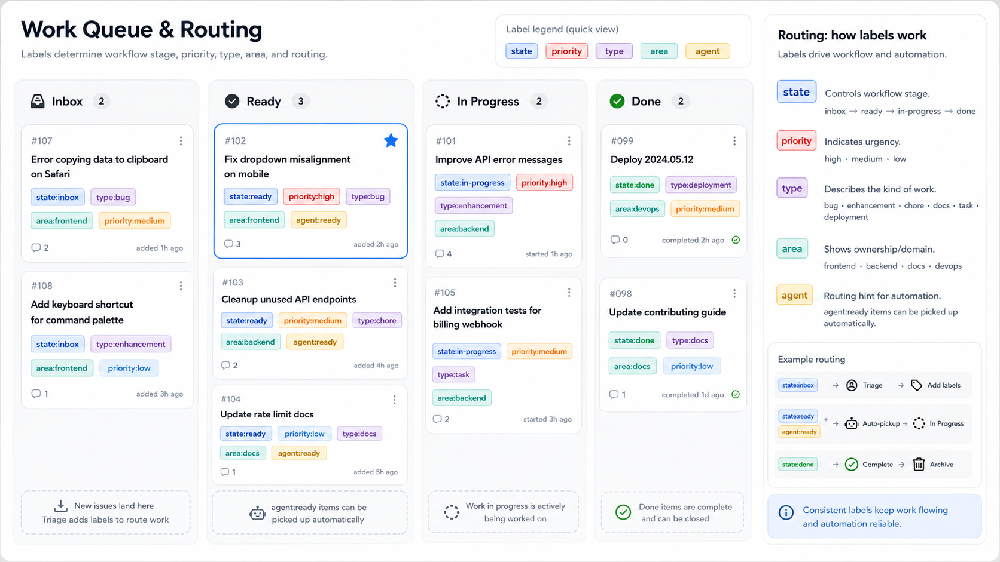
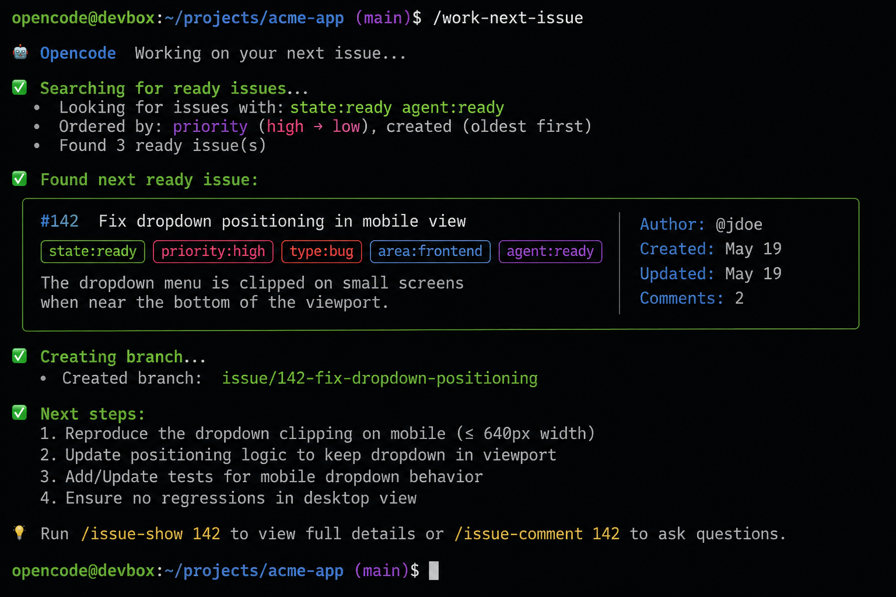
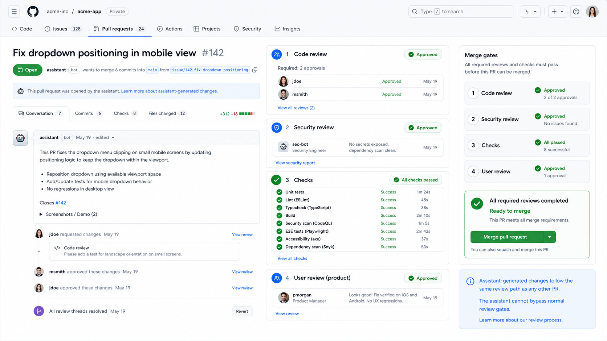

For a while, my AI coding workflow was simple: open a browser, ask GPT for help, copy the answer, paste it into Neovim, and see what broke.

At the time, that felt powerful.

I could move faster. I could ask questions when I got stuck. I could use AI as a second set of eyes when I did not understand a file or a bug.

But the whole process still depended on me being the middle step for everything.

I carried the context from the repo to the browser. I copied code back into my editor. I ran the commands. I pasted errors back into the chat. I decided what files mattered and what output was important.

The AI helped, but it was still outside the real workflow.

That is the part I started wanting to change.

Looking back, the progression has been pretty clear:

```text
Browser ChatGPT + Neovim copy-paste
opencode inside the repo + multiple agents
GitHub Issues as the queue + PRs as the decision point
```

Each step removed one layer of manual work.

The browser helped me get answers.

opencode helped the assistant work inside the project.

This new workflow helps agents move work forward without me carrying every step by hand.

## From Browser Help to Repo Help

The first big step was moving from browser-based help to opencode.

That changed the shape of the work.

Instead of copying code between a chat window and Neovim, the assistant could work closer to the repo. It could inspect files, understand the project layout, make edits, and run verification from the same environment where I was already working.

That was a real upgrade.

But it also taught me something important: better repo access is not enough by itself.

Once I started using multiple agents, the difference became even clearer.

One agent could implement. Another could review the code. Another could look at security concerns. That made the assistant feel less like a single chat response and more like a small workflow running inside the repo.

Once an assistant can change code, the question becomes bigger than, "Can it solve this problem?"

The better question is:

Can it work safely inside a repeatable process?

That is where my thinking shifted. I stopped focusing only on better prompts and started focusing on better workflow design.

From there, I started linking this setup with my GitHub repos and dotfiles. I wanted the workflow to travel with me the same way my editor config, shell habits, and project setup do.

The assistant was no longer just a tool I opened sometimes.

It was becoming part of my development environment.

## GitHub Issues Became the Queue

The biggest change was making GitHub Issues the source of truth.

Instead of asking the assistant to do random work from a chat prompt, I wanted the work to start from a real issue.

The issue explains the task.

The labels explain how to handle it.

The PR shows what changed.

That simple structure makes the whole system easier to trust.

For an issue to be picked up by the assistant, it needs two important labels:

- `state:ready`
- `agent:ready`

`state:ready` means the work is clear enough to start. `agent:ready` means it is safe for the assistant to work on without needing more discussion first.

If one of those is missing, the assistant should skip it.

That small rule matters because not every task should be automated. Some issues are too vague. Some need product judgment. Some touch sensitive parts of the project. Those should wait for me.



## Labels Became Guardrails

The labels are not just decoration. They are part of the workflow.

Each issue can carry state, priority, type, area, and agent-routing labels.

That gives the assistant enough information to make basic decisions without guessing.

For example:

```text
state:ready
priority:high
type:bug
area:frontend
agent:ready
```

That tells the assistant the issue is ready, important, bug-related, frontend-focused, and safe to pick up.

This was one of the biggest lessons for me: if I keep explaining the same rule to the assistant, that rule probably belongs in the workflow.

Labels turn repeated judgment into visible structure.

That is better than starting every session with a long prompt trying to explain the same boundaries again.

## The Loop Is the Interesting Part

The more I worked with agents, the more I started thinking about loops.

Not one prompt.

Not one answer.

A loop.

Pick up the next ready issue. Create a branch. Inspect the repo. Make the smallest correct change. Run verification. Review the result. Prepare the PR. Move the issue forward.

That is where AI coding starts to feel different.

I do not want to copy code from one window to another forever. I want to define the direction, give the system safe boundaries, and let the assistant handle the mechanical parts of the loop.

The issue moves through states like `claimed`, `in-progress`, `agent-review`, and `user-review`.

That movement makes the work visible. I can see what is being worked on, what is being checked, and what is waiting for me.

The goal is not hidden automation.

The goal is inspectable automation.

## Making It Repeatable With opencode Commands

To make this workflow easier to reuse, I started building custom opencode commands.

The important ones are:

| Command | Purpose |
| --- | --- |
| `/github-workflow-init` | Bootstraps the standard issue workflow into a repo |
| `/work-next-issue` | Works the next issue marked ready for the assistant |
| `/review-my-prs` | Helps me process PRs waiting for my attention |

`/github-workflow-init` sets up the workflow pattern in a repo.

`/work-next-issue` is the execution loop. It lets the assistant find the next ready issue, claim it, create a branch, implement the change, run verification, and prepare a PR.

`/review-my-prs` brings the focus back to me. It helps summarize what changed, what checks passed, and what still needs a decision.

This is where my dotfiles started to matter too. I do not want a good workflow trapped in one repo. I want to carry it across projects the same way I carry my editor setup.



## Review Is Still the Gate

The assistant can work through the loop, but it does not get the final word.

Before a PR is ready for me, it should pass two review gates:

- Coding review
- Security review

The coding review checks whether the implementation matches the issue, stays focused, avoids unnecessary complexity, and includes the right verification.

The security review looks for risky changes: exposed secrets, weak access control, unsafe input handling, or deployment mistakes.

GitHub Actions add another signal layer with builds, tests, linting, and deployment context.

But passing checks is not the same as making the right decision.

That still belongs to me.



## Becoming the Last Word

This is the part that feels like the real growth.

In the browser-copy-paste version, I was the transport layer. I moved the context, code, commands, and results by hand.

In this version, the assistant can handle more of that loop itself.

That does not mean I disappear from the process.

It means I stop being the middle step for every tiny action.

My role moves closer to direction, review, and final approval.

I decide what matters. I decide what tradeoffs are acceptable. I decide whether a PR should merge.

Taking myself out of the middle does not mean taking myself out of responsibility.

It means building a system where the assistant can move structured work forward safely, and I can focus on the decisions that actually need me.

That is what I want from my AI coding assistant.

Not a magic box.

Not a replacement developer.

Not another chat window full of copied code.

A repeatable workflow.

A clear queue.

Good guardrails.

And a pull request waiting for my final word.
