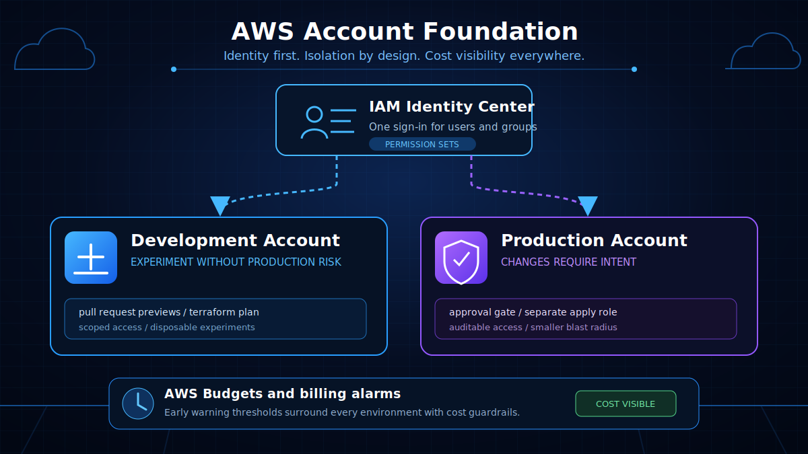
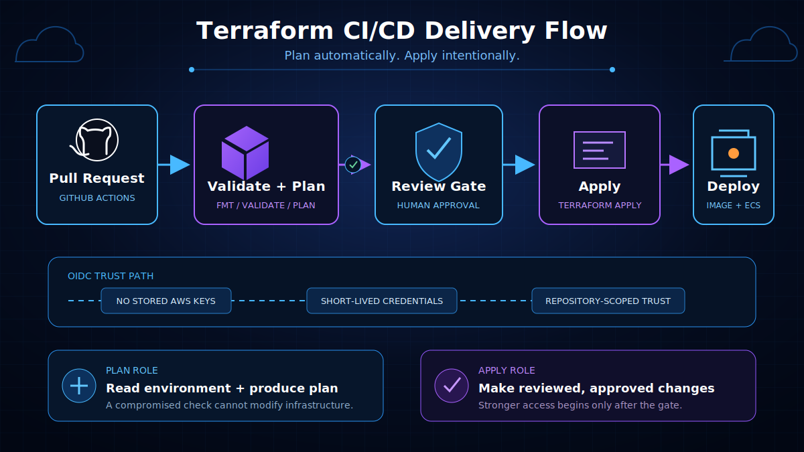
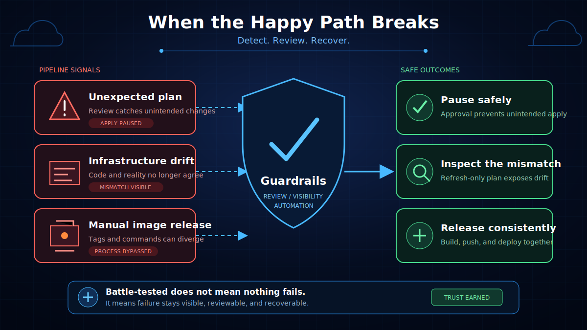

A few months ago, I wrote about [moving from the AWS console to Terraform](/blog/aws-terraform-infrastructure). I was proud of that post because it captured a real shift in how I thought about infrastructure: from clicking around to describing resources in code, from one-off experiments to something I could repeat.

But looking back, that post ended with the CI/CD workflow still in the design phase. I had drawn the boundary between plan and apply roles. I knew what I wanted to build.

I had not actually built it yet.

This post is about what happened when I did. It is about the AWS account structure, identity setup, billing guardrails, and delivery pipeline I put in place to make the infrastructure safe to change. And it is about what that work taught me about growing as an engineer.



## The Gap I Did Not See at First

When I started with AWS, every service made sense on its own. S3 stores things. Lambda runs code. RDS gives you a database. IAM controls access. You learn them one by one, pass a few certifications, and start to feel like you understand the cloud.

What took longer was seeing the gaps between those services. The places where the real work lives.

I could build a VPC. I could write Terraform. I could even plan a CI/CD pipeline. But I did not yet have an environment where someone else could safely change something I had built. That is a different skill, and it is the one I have been working on since.

## Starting With the Foundation: AWS Accounts

The first change was the simplest to describe and the hardest to undo later: I stopped doing everything in one account.

For this project, my AWS setup still lived in a single account. IAM can separate workloads within one account, but an account boundary provides stronger isolation when production and experimentation need different access and risk profiles.

Within AWS Organizations, I separated the workloads into at least two member accounts:

- A **development** account for experiments, pull request validation, Terraform plans, and anything I was not ready to trust yet.
- A **production** account for the resources that mattered.

That separation changes how you think about risk. A mistake in a shared account has more opportunity to reach production resources. Separate accounts reduce that blast radius, making it safer to experiment in development without relying only on policy boundaries inside one account.

It also makes permissions easier to reason about. A role that can deploy in development does not automatically have power over production. The boundary is structural, not just a policy line buried in JSON.

## IAM Identity Center: The Entry Point

Once I had more than one account, logging in became a problem. I did not want to manage separate IAM users in each account. I did not want to pass around access keys. And I definitely did not want root credentials involved in day-to-day work.

That is where IAM Identity Center became the entry point to the setup.

With IAM Identity Center, users sign in once and get access to the accounts and permission sets they need. I set up permission sets for different roles, assigned them to accounts, and mapped users and groups to those assignments.

When I have built this foundation for clients, it can feel like overkill at first, especially for a small team. But the goal is not to optimize only for the organization as it looks today. It is to keep the setup understandable as more people and accounts are added, and as questions about who can do what become more important.

The biggest lesson was that identity is not a one-time setup task. It is a habit. IAM Identity Center handles workforce access for people, while automation needs its own identity and permissions. Every time I add an account, tool, or workflow, I have to decide how it authenticates and what it is allowed to touch instead of hiding that decision in a long-lived access key.

## AWS Budgets Alerts and Cost Guardrails

Cost was another area I had ignored for too long. When everything is small, AWS feels cheap. A few dollars a month does not seem worth monitoring. But small experiments can spiral: a forgotten NAT Gateway, a misconfigured load balancer, a compute job left running.

I set up AWS Budgets alerts with a few thresholds:

- A monthly budget at a level I was comfortable with.
- An alert at a lower percentage so I would notice a trend before it became a problem.
- A higher threshold for something that needed immediate attention.

The thresholds themselves matter less than the discipline. The alerts made me think about cost every time I created a resource. They turned spending from something I checked at the end of the month into something I designed around.

AWS Budgets alerts are not real-time spending controls, and billing data can be delayed. They still provide useful visibility into cost trends. Knowing that I would be notified after a threshold was crossed made experimentation feel safer, while reminding me that alerts do not replace actively reviewing the resources I create.

## Implementing the CI/CD Workflow

With the infrastructure designed, the account structure and identity layer in place, and the application's wireframes and user flows mapped out, I moved on to implementing the CI/CD workflow.

The core idea was the same one I wrote about earlier: separate the cheap, safe step from the expensive, risky one. Plan should be automatic. Apply should be intentional.

I used GitHub Actions with OIDC to authenticate to AWS. The workflow exchanges a GitHub OIDC token for temporary AWS credentials through STS, so no long-lived access keys need to live in GitHub secrets. The role trust policy scopes access to the expected repository and workflow context, and each role is limited to the account and permissions it needs.

The pull request workflow runs the checks you would expect:

```bash
terraform init -input=false
terraform fmt -recursive -check
terraform validate
terraform plan -out=development.tfplan
terraform show -no-color development.tfplan
```

That produces a saved plan and reviewable output before anything changes. A saved plan can contain sensitive values, so I treat it as a protected artifact and keep it scoped to the same account, backend, and environment that produced it. The apply workflow is separate, protected by a GitHub Environment approval gate, and uses a different IAM role with stronger permissions.

The plan role and apply role are intentionally not the same. The plan role can read the environment and produce a plan but is not authorized to modify the managed infrastructure. The apply role can make the reviewed changes. Splitting them reduces the permissions available to a compromised plan job and gives mistakes in the plan workflow a smaller blast radius.

I also added container image builds and pushes to the same flow. Terraform can build the environment, but the pipeline has to build and ship the app into that environment. Keeping those steps in one place made the whole release easier to reason about.



## What Made It Battle-Tested

A pipeline is not battle-tested because it ran once. It is battle-tested when something goes wrong and it behaves the way you hoped.

For me, the first real test was a plan that looked harmless but would have changed something I did not intend to change. Because the apply step required approval and a separate role, I had time to catch it. That is the moment the design stopped being theory and started being protection.

Another test was drift. Remote AWS resources can diverge from the configuration, and provider updates can change what appears in a plan. The pipeline did not eliminate those differences, but it made them visible. When Terraform showed an unexpected change, I could pause and determine whether to update the configuration or intentionally accept the remote change through a reviewed refresh-only plan and apply.

The pipeline also changed how I worked with the existing ECS Express Mode setup. Before, deploying a new image meant running commands by hand and hoping I remembered the right tag. After, the pipeline built the image, pushed it, and updated the running service through the same approval flow as infrastructure changes. That consistency mattered more than I expected.



## What I Learned About Engineering

Building this pipeline taught me a few lessons that go beyond Terraform and GitHub Actions.

**Plan should be cheap; apply should be intentional.** This changed how I think about risk. The goal is not to make every change fast. The goal is to make every change reviewable.

**Automation reveals where your process is unclear.** I found that steps I could not express clearly in a workflow usually needed more thought. Writing the pipeline forced me to clarify decisions I had been making instinctively.

**Trust comes from visibility, not speed alone.** For infrastructure changes, a pipeline that shows its work is more useful than one that is fast but opaque. People trust systems they can inspect.

**CI/CD is a communication tool.** It tells the team how changes are supposed to flow. The workflow acts as executable documentation, while a README or runbook captures the rationale, prerequisites, and recovery steps that code alone cannot explain.

## What I Learned About Myself

The harder lessons were personal.

I had to move from "I can do this" to "someone else can do this safely." That meant letting go of being the single person who understood every piece. It meant building guardrails that would catch mistakes even when I was not the one making them.

That felt risky at first. Manual control feels safe because you are always in the loop. But manual control does not scale, and it does not survive a bad day. Building a system that works without me hovering over it was more satisfying than I expected.

I also started asking better questions. Not "does this work?" but "what happens when it breaks?" Not "can I deploy this?" but "can the right person deploy this at the right time?" Those questions are the difference between building features and building infrastructure.

## Where This Fits in 2026

My experience with infrastructure engineering in 2026 has been less about knowing every AWS service and more about building systems other people can operate. Platform engineering, AI-assisted coding, and policy-as-code all reinforce the value of creating safe, repeatable workflows instead of relying on commands that only one person knows how to run.

That does not mean individual skill stops mattering. It means skill gets expressed differently. The best engineers I know are not the ones with the fastest hands. They are the ones who build environments where good decisions are easy and bad decisions are hard.

## What I Would Tell Myself a Year Ago

If I were starting this phase over, I would tell myself a few things:

1. **Start with account structure and identity.** Pipelines are only as safe as the environment they run in.
2. **Set budget alerts on day one.** Even small environments deserve cost visibility.
3. **Build one safe change at a time.** Do not try to perfect the whole pipeline before you ship the first useful version.
4. **Document the workflow as if someone else will inherit it.** They will, even if that someone is you six months from now.
5. **Spend enough time on approvals and review boundaries.** The automation mechanics are only part of the work. The trust design matters just as much.
6. **The goal is not to remove humans.** It is to make human decisions clearer, slower when they need to be, and easier to trace and recover from.

---

This phase of the project started as a follow-up to my Terraform work. It became a lesson in how infrastructure engineering really grows. The code matters, the tools matter, but the biggest change was in how I think about ownership, safety, and building things that can outlast my own attention.
